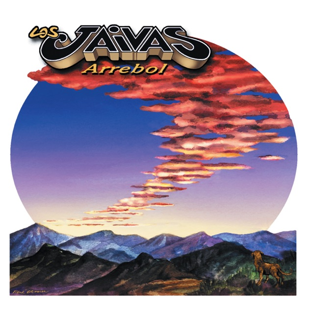

solemne-02  
(https://editor.p5js.org/renata.danyan/sketches/qRiTOsdOp)

Integrantes del grupo

(Renata Danyan Correa) rreniss

Descripción del disco

(Arrebol)
2001
Los Jaivas

Tracklist
1. Arrebol.
2. Milonga Carcelaria.
3. Alegria de mi amor.
4. Todos Americanos.
5. Por los niños del mundo.
6. Libre Albedrío.
7. Vamos por ancho camino.
8. Chile
9. Me encontré al diablo.
10. Pololeo por computer.
11. Amores de antes.
12. Que suerte tengo.
13. El recidente nacional.

    
Aspecto del álbum a desarrollar (premisa)
>El proyecto busca interpretar la atmosfera visual y emocional del álbum "Arrebol" de los Jaivas, utilizando 
paisajes andinos, cambios de color y movimiento lento para representar la sensación contemplativa y musical del disco.
Me interesó trabajar la relación entre la naturaleza, cielo y movimiento, inspirandome en tonos cálidos y montañas 
presentes en la portada del álbum.
Por lo que mi visión siempre fue montañas coloridas en movimiento, un sol andino y nubes.

Conclusión del proceso

Distancia entre premisa y resultado

>En el resutlado final logré representar gran parte de la atmósfera que quería transmitir. Aunque el proyecto comenzó con la
idea de recrear elementos de la portada del álbum, el proyectof ue evolucionando hacia una interpretación más libre inspirada 
en los paisajes, colores y sensaciones asociadas al disco.
El uso de movimiento lento en las montañas y nubes ayudó a generar una imagen más tranquila, mientras que el cambio de color 
del cielo permitieron un poco de profundidad visual a la imagen.

Cosas no conseguidas

>En un principio quise agregar más elementos animados, como estrellas y efectos de opacidad, pero se me dificultó mucho por lo 
que decidí simplificar mi proyecto para priorizar una composición tranquila con codigos que comprendo.

Descubrimientos al trabajar

>Durante el desarrollo descubrí que la función sin() permite generar movimientos y cambios mucho más suaves y orgánicos, evitando 
animaciones bruscas o cortadas. También aprendí a mover imagenes utilizando variables de posición y comprendí mejor cómo funcionan 
widht y height para adaptar elementos al tamaño del canvas.

Explicación del código (3 aspectos)
Bloque de código 1
sol = loadImage(./sol.png);

+Este código carga las imágenes que luego se utilizan dentro del canvas. Además es muy importante importar las imagenes al sketch y 
nombrarlas correctamente para hacer uso de ellas en los códigos.

Bloque de código 2
nube1X = nube1X + 0.2;
nube2X = nube2X - 0.15;

+Este código genera el movimiento horizontal de las nubes. El valor + 0.2; hace que la nube avance lentamente hacia la derecha, y que 
en cada frame aumenta su posición en X. En cambi el valor - 0.15; hace que la nube2 se mueva hacia la izquierda, porque su posición 
disminuye constantemente.

Bloque de código 3
let r = 190 + sim(frameCount * 0.005) * 30;

+Este codigo genera cambios suaves en el color del cielo. FrameCount permite usar el tiempo transcurrido y sin() crea una transición 
lenta y progresiva en los valores RGB.

Declaración sobre el uso de IA
IA utilizada(s) y tipo de licencia (gratuita)
-Gemini, gratis.

Problema a resolver a través de la IA
>Comprender cómo generar movimiento suave utilizando variables, frameCount y sin(), además de resolver dudas sobre posicionamiento de
imágenes y cambios de color.

Prompts utilizados
Cómo puedo mover mis imagenes de montaña lentamente? 

Cómo puedo generar cambios suaves de color usando frameCount y sin()?

Prompt 3

Secciones de código entregadas por la IA
Movimiento lento de montañas 
image(montana1, montana1X, height/2, width, height/2);

Cambio de color suave (fondo)
let r = 190 + sin(frameCount * 0.005) * 30;
